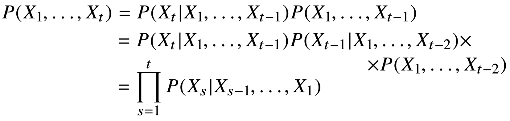
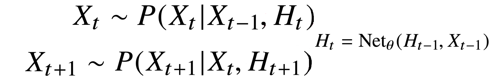
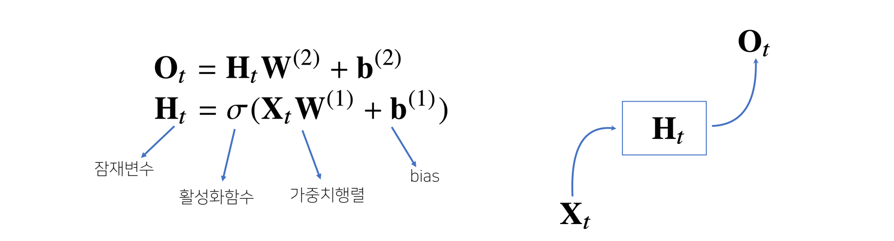
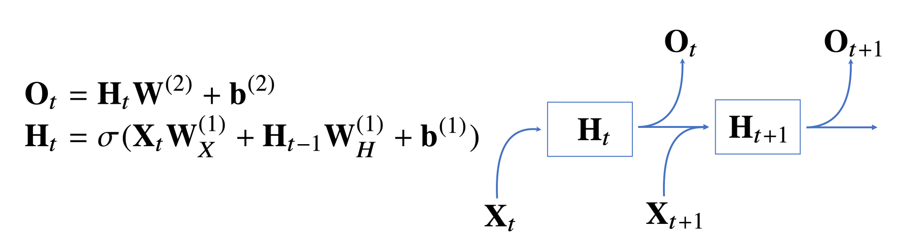
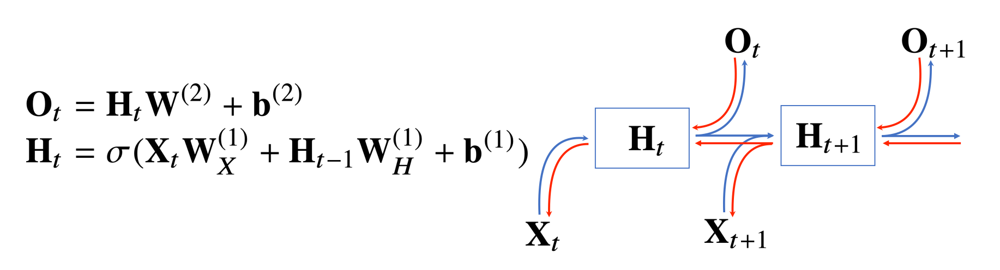
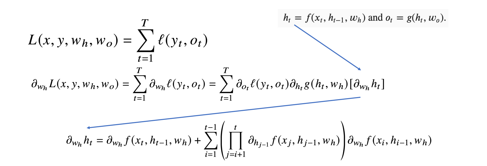
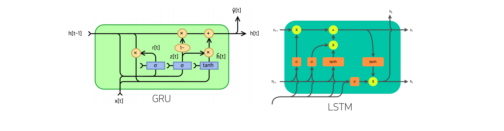

## RNN

순환 신경망(Recurrent Neural Network, RNN)은 CNN과 달리
시계열(time-series) 데이터, sequence 데이터에 많이 적용되는 모델

- **시퀀스 데이터**

  - 시간 또는 규칙에 따라 순차적으로 들어오는 데이터
    - 소리, 문자열, 주가 등
    - 이벤트 발생 순서가 중요한 요소인 데이터
  - 독립동등분포(i.i.d.) 가정을 잘 위배하기 때문에 순서를 바꾸거나 손실이 발생하면 확률분포가 바뀜
    - 순차적으로 들어오는 데이터를 다룰 방법을 고려

- 시퀀스 데이터를 다루는 법

  - 이전 시퀀스의 정보를 가지고 앞으로 발생할 데이터의 확률분포를 다루기 위해
    조건부 확률을 이용
    

    > 대문자 Π(파이)는 모두 s=1부터 t까지 모두 곱하라는 기호 

    - 베이즈 법칙을 사용

  - 시퀀스 데이터를 다루기 위해선 길이가 가변적인 데이터를 다룰 수 있는 모델이 필요
    

    - 시퀀스 데이터 분석에 모든 과거 데이터가 필요한 것은 아님
    - 고정된 τ만큼의 시퀀스만 사용하는 경우 자기회귀모델(Autoregressive Model, *AR*(τ))이라고 부름

    

    - 다른 방법은 이전 정보를 제외한 나머지 정보들을 Ht라는 잠재변수로 활용하는 잠재 AR 모델
    - 잠재변수 Ht를 신경망을 통해 반복해서 사용하여 시퀀스 데이터의 패턴을 학습하는 모델이 RNN

- **Recurrent Neural Network** 이해하기

  - 기본적인 RNN모형은 MLP와 유사
    

    - W(1), W(2)은 시퀀스와 상관없이 불변인 행렬
    - 위 모델은 과거의 정보를 다룰 수 없음

    

    - 잠재변수인 Ht를 복제해서 다음 순서의 잠재변수를 인코딩하는데 사용

  - RNN의 역전파는 잠재변수의 연결그래프에 따라 순차적으로 계산
    

    - Backpropagation Through Time(BPTT)이라 하는 RNN의 역전파 방법

- **BPTT**

  - BPTT를 통해 RNN의 가중치 행렬의 미분을 계산하면 미분의 곱으로 이루어진 항이 계산됨

    

    - 시퀀스 길이가 길어질 수록 미분값이 너무 커지거나 작아지는 등 불안정해짐

- 기울기 소실의 해결책

  - 시퀀스 길이가 길어지는 경우 BPTT를 통한 역전파 알고리즘의 계산이 불안정

    - 길이를 끊는 것이 필요
    - truncated BPTT

  - Vanilla RNN은 길이가 긴 시퀀스를 처리하기 어려움

    

    - 이를 해결하기 위해 등장한 RNN 네트워크인 LSTM, GRU
