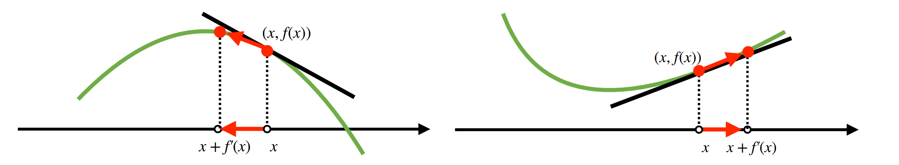
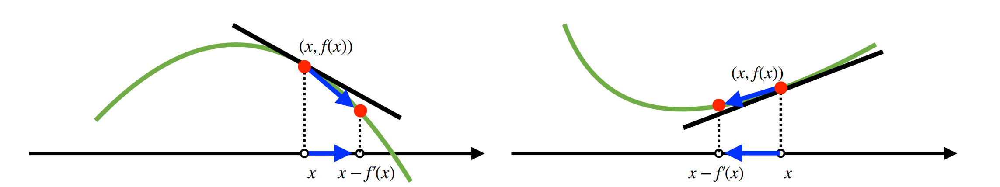

## [*](../AI_Math_Keyword/)경사하강법 - 순한맛

- **미분**
  - 변수의 움직임에 따른 함수값의 변화를 측정하는 도구
  - 최적화에서 가장 많이 사용하는 기법
  -  `sympy.diff`로 컴퓨터를 통해 계산 가능

- **미분의 용도**

  - 미분은 함수 ***f***의 주어진 점 (x, ***f***(x))에서의 접선의 기울기를 도출

  - 접선의 기울기를 통해 이동 방향에 따라 함수값의 증감 확인

  - 경사상승법(gradient ascent)

    - 미분값을 더해 함수의 극대값의 위치를 구할 때 사용
    - 목적함수를 최대화할 때 사용

    

  - 경사하강법(gradient descent)

    - 미분값을 빼 함수의 극소값의 위치를 구할 때 사용
    - 목적함수를 최소화할 때 사용

    

  - 경사상승/경사하강 방법은 극값에 도달하면 움직임을 멈춤

- **경사하강법 알고리즘**
  
  - 컴퓨터 계산은 미분값이 정확히 0이 되는 것이 불가능 → `eps`보다 작을 때 종료하는 조건 추가
  - `lr`은 학습률로 업데이트 속도를 조절 → 수렴 여부를 결정하는 중요한 조건으로 세밀한 조정 필요

- **변수가 벡터일 경우**
  - 벡터가 입력인 다변수 함수의 경우 편미분(partial differentiation)을 사용
  - `sympy`
  - 각 변수 별로 편미분을 계산한 그레디언트 벡터를 이용하여 경사하강/상승법에 사용

- **그레디언트 벡터**
  
  - ∇***f***: 원점에서 가장 빨리 증가하는 방향으로 흐름
  - -∇***f*** : 임의의 점에서 가장 빨리 감소하는 방향으로 흐름
