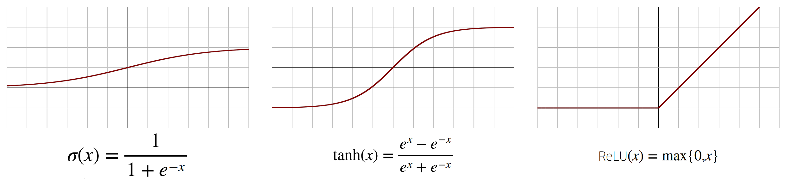
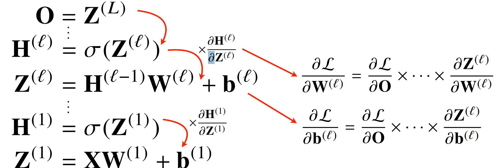

## 딥러닝 학습방법 이해하기

- 비선형모델 **신경망**
  - 소프트맥스 연산
    - 모델의 출력을 확률로 해석할 수 있게 변환해주는 연산
    - 분류 문제를 풀 때 선형 모델과 소프트맥스 함수를 결합하여 예측
    - 학습을 하는 경우에 필요한 함수로, 추론만 할 경우 불필요
  - 신경망은 선형모델과 **활성함수**를 합성한 함수
    - 활성함수는 R위에 정의된 비선형 함수
    - 실수값을 입력받아 실수값을 출력
    - 활성함수를 사용하지 않으면 선형모형과 차이가 없음
    - 시그모이드, tanh함수를 전통적으로 많이 써왔고 딥러닝에선 ReLU함수를 많이 씀
      
  - 잠재벡터 H를 가중치 행렬 W(2)와 b(2)를 통해 선형변환하면 (W(2), W(1))를 파라미터로 가진 2층 신경망
  - 다층 퍼셉트론(Multi Layer Perceptron)은 신경망이 여러층 합성된 함수
    - MLP의 파라미터는 L개의 가중치 행렬과 W(L), ... , W(1)로 이루어져있다
  - 순차적인 신경망 계산을 순전파(forward propagation)라 부름
    - 학습이 아닌 주어진 입력이 왔을 때 출력하는 과정
- 왜 층을 여러개 쌓을까?
  - 2층 신경망으로도 임의의 연속함수를 근사할수 있지만, 층이 깊을수록 목적함수를 근사하는데 필요한
    뉴런(노드)의 숫자가 빠르게 줄어들어 효율적인 학습이 가능
    - 필요한 파라미터 수의 감소
    -  층이 얇으면 필요한 뉴런의 숫자가 기하급수적으로 늘어나 넓은 신경망이 되어야 함

  - 층이 깊은 것이 최적화를 의미하지는 않음

- **역전파**(back propagation) 알고리즘

  - 딥러닝은 역전파 알고리즘을 이용하여 각 층에 사용된 파라미터 {W(l), b(l)}Ll=1를 학습

  - 손실함수를 L이라 했을 때, 역전파는 δL/δW(l) 정보를 계산할 때 사용

  - 각 층 파라미터의 그레디언트 벡터를 계산한 후 위층부터 아래층까지 역순으로 전달하며 계산

    - 합성함수의 미분법인 연쇄법칙을 사용하여 그레디언트 벡트를 전달
      

      

  - 연쇄법칙 기반 가동미분을 사용

    - δz/δx = δz/δw * δw/δx
    - 각 노드의 텐서 값을 컴퓨터가 기억해야 미분 계산이 가능
    - 순전파 방식에 비해 메모리 사용량이 많음
