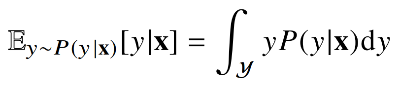
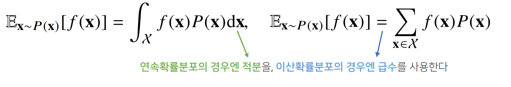

## 확률론 맛보기

- **필요성**
  - 딥러닝은 확률론 기반의 기계학습 이론에 바탕을 둠
  - 기계학습에서 사용되는 손실함수들의 작동원리는 데이터 공간을 통계적으로 해석해서 유도
  - L2-노름은 예측오차의 분산을 가장 최소화하는 방향으로 학습을 유도
  - 교차엔트로피는 모델 예측의 불확실성을 최소화하는 방향으로 학습을 유도
  - 분산 및 불확실성을 최소화하기 위해 측정법을 알아야 함

- **확률분포**
  - 데이터의 초상화
  - 데이터 공간을 x * y라 표기하고 D는 데이터공간에서 데이터를 추출하는 분포
  - 데이터는 확률변수로 (x, y) ~ 라 표기
  - 결합분포 P(x, y)는 D를 모델링
    - D는 이론적으로 존재하는 확률분포로 사전에 알 수 없음
    - 원래 데이터의 확률 분포와 상관 없이 모델링에 따라 실증적 분포를 결정할 수 있음

  - P(x)는 입력 x에 대한 주변확률분포로 y에 대한 정보를 주지 않음
    - 주변확률분포 P(x)는 결합분포 P(x,y)에서 유도 가능

  - 조건부확률분포 P(x|y)는 데이터 공간에서 입력 x와 출력 y사이의 관계를 모델링
    - P(x|y)는 특정 클래스가 주어진 조건에서 데이터의 확률분포를 나타냄

- **이산확률변수와 연속확률 변수**
  - 확률변수는 확률분포 D에 따라 이산형(discrete)와 연속형(continuous)로 구분
  - 데이터 공간에 의해 결정되는 것이 아님
  - 이산형 확률변수
    - 확률변수가 가질 수 있는 경우의 수를 모두 고려하여 확률을 더해서 모델링
      
    - P(X = x)는 확률변수가 x값을 가질 확률로 해석

  - 연속형 확률변수
    - 데이터 공간에 정의된 확률변수의 밀도 위에서의 적분을 통해 모델링
      
    - 밀도는 누적확률분포의 변화율을 모델링하며 확률로 해석하면 안 됨

- **조건부 확률과 기계학습**
  - 조건부확률 P(y|x)는 입력변수 x에 대해 정답이 y일 확률
    - 연속확률분포일 경우 밀도로 해석함을 주의

  - 로지스틱 회귀에서 사용한 선형모델과 소프트맥스 함수의 결합은
    데이터에서 추출된 패턴을 기반으로 확률을 해석하는데 사용
  - 분류 문제에서 softmax(WΦ + b)은 데이터 x로부터 추출된 특징패턴 Φ(x)과
    가중치행렬 W를 통해 조건부확률 P(y|x)을 계산
    - P(y|Φ(x))로 표기 가능

  - 회귀 문제의 경우 조건부기대값 E[y|x]을 추정
    - 조건부 기대값은 E∥y-*f*(x)∥2을 최소화하는 함수 *f*(x)와 일치

  - 딥러닝은 다층신경망을 사용하여 데이터로부터 특징패턴Φ을 추출합니다

- **기대값**(expectation)
  - 확률분포가 주어지면 데이터를 분석하는 데 사용 가능한 여러 종류의 통계적 범함수를 계산 가능
  - 기대값은 데이터를 대표하는 통계량이면서 동시에 확률분포를 통해
    다른 통계적 범함수를 계산하는데 사용
    
  - 기대값을 이용해 분산, 첨도, 공분산 등 여러 통계량을 계산할 수 있음
- [#](../AI_Math_Keyword/)**몬테카를로 샘플링**
  - 기계학습의 많은 문제들은 확률분포를 명시적으로 모를때가 대부분
  - 확률분포를 모를 때 데이터를 이용하여 기대값을 계산하기 위해 몬테카를로 샘플링 방법을 사용
    
  - 이산형, 연속형에 상관없이 성립
  - 샘플링하는 분포에서 독립적으로 샘플링을 해야 작동
    - 확률 분포를 몰라도 샘플링만 가능하면 기대값을 계산할 수 있음
  - 독립추출만보장된다면 [#](../AI_Math_Keyword/)대수의 법칙(law of large number)에 의해 수렴성을 보장
    - 적절한 샘플링 개수를 선정하는 것이 중요
