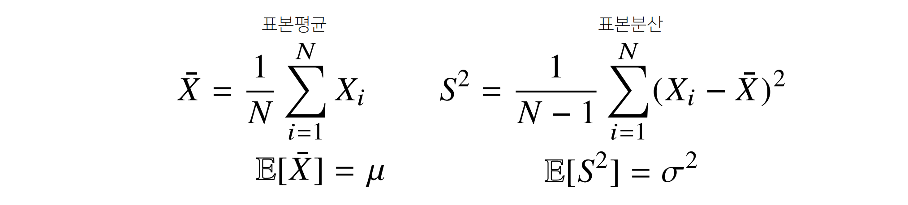
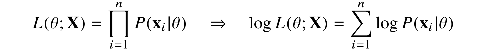

## 통계학 맛보기

- **모수**
  - 통계적 모델링은 적절한 가정 위에서 확률분포를 추정하는 것이 목표
    - 기계학습과 통계학이 공통적으로 추구하는 목표

  - 유한한 개수의 데이터로 모집단의 분포를 알아내는 것은 불가능
    - 근사적으로 확률분포를 추정

  - 모수적 방법론
    - 특정 확률분포를 따른다고 선험적으로 가정한 후 분포를 결정하는 모수를 추정하는 방법 

  - 비모수 방법론
    - 특정 확률분포를 가정하지 않고 데이터에 따라 모델의 구조 및 모수의 개수가 유연하게 바뀌는 방법
    - 모수가 없는 것이 아닌 모수가 무한히 많거나 데이터에 따라 변하는 방법론

- **확률분포 가정**
  - 예시
    - 데이터가 2개의 값만 가지는 경우 → 베르누이분포
    - 데이터가 n개의 이산적인 값을 가지는 경우 → 카테고리분포
    - 데이터가 [0,1] 사이에서 값을 가지는 경우 → 베타분포
    - 데이터가 0 이상의 값을 가지는 경우 → 감마분포, 로그정규분포 등
    - 데이터가 R 전체에서 값을 가지는 경우 → 정규분포, 라플라스 분포 등
  - 기계적으로 확률분포를 가정하는 것이 아니라, 데이터를 생성하는 원리를 먼저 고려하는 것이 원칙
    - 각 분포마다 검정하는 방법이 있으므로 모수를 추정한 후에는 반드시 검정 실시

- **모수 추정**

  - 데이터의 확률분포를 가정했다면 모수 추정이 가능

  - 정규분포의 모수는 평균 μ과 분산 σ²

    

    - 표본분산을 구할 때 N-1로 나누는 이유는 불편 추정량을 구하기 위함

  - 통계량의 확률분포를 표집분포(sampling distribution)라 부르며, 특히 표본평균의 표집분포는
    N이 커질수록 정규분포 Ｎ(μ, σ²/N)를 따른다.

    - 중심극한정리라 부르며 모집단의 분포가 정규분포를 따르지 않아도 성립함

- **최대가능도 추정법**

  - 이론적으로 가장 가능성이 높은 모수를 추정하는 방법
  - 표본평균이나 표본분산은 중요한 통계량이나, 확률분포마다 사용하는 파라미터가 조금씩 달라
    적절한 모수를 추정하는 적절한 통계량이 달라짐
    - 기계적으로 두 요소만 가지고 확률 분포를 추정하는것은 위험
  - MLE, maximum likelihood estimation
    
  - 가능도 함수는 모수 θ를 따르는 분포가 x를 관찰할 가능성을 의미하나 확률이 아님
  - 데이터 집합 X가 독립적으로 추출되었을 경우 로그가능도를 최적화
    

- **로그 가능도**

  - 로그가능도를 최적화하는 모수 *θ*는 가능도를 최적화하는 MLE
  - 데이터의 수가 수억단위가 되면 컴퓨터의 정확도로 가능도를 계산하는 것이 불가능
  - 데이터가 독립일 경우 로그를 사용해 가능도의 곱셈을 로그가능도의 덧셈으로 바꿔 연산 가능
  - 경사하강법으로 가능도를 최적화할 때 로그 가능도를 사용하여 미분 연산하면 연산량을
    *O(n²)* 에서 *O(n)*으로 줄임
  - 대게의 손실함수의 경우 경사하강법을 사용하므로 음의 로그가능도를 최적화

**Further Question**

1. 확률과 가능도의 차이는 무엇일까요? (개념적인 차이, 수식에서의 차이, 확률밀도함수에서의 차이)
   
2. 확률 대신 가능도를 사용하였을 때의 이점은 어떤 것이 있을까요?
   
3. 다음의 code snippet은 어떤 확률분포를 나타내는 것일까요?
   해당 확률분포에서 변수 theta가 의미할 수 있는 것은 무엇이 있을까요?
