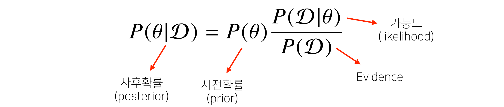
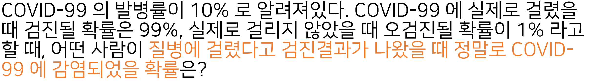
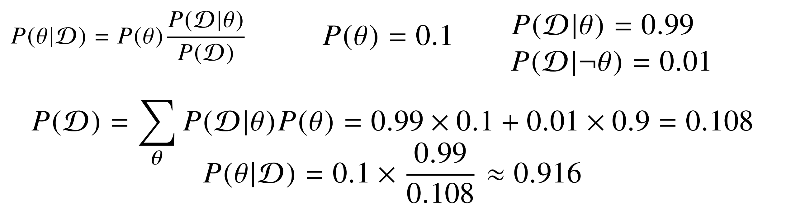
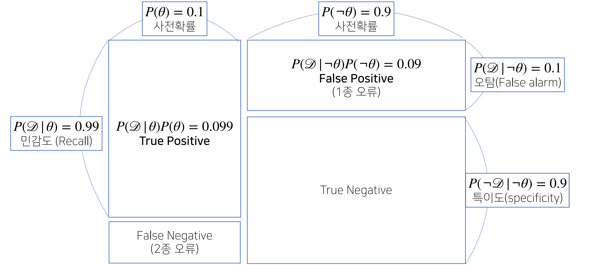
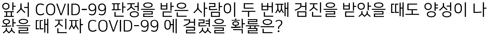
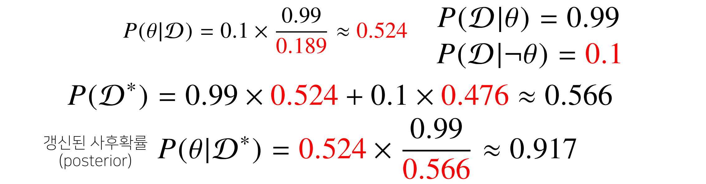
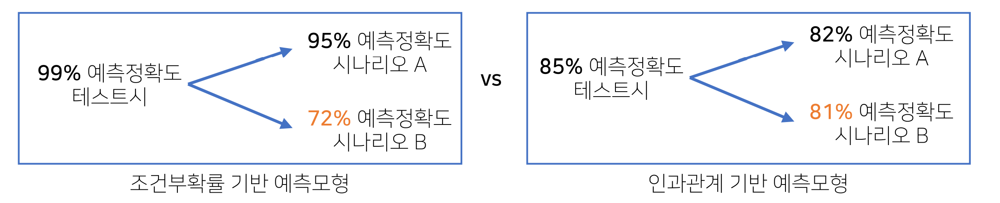
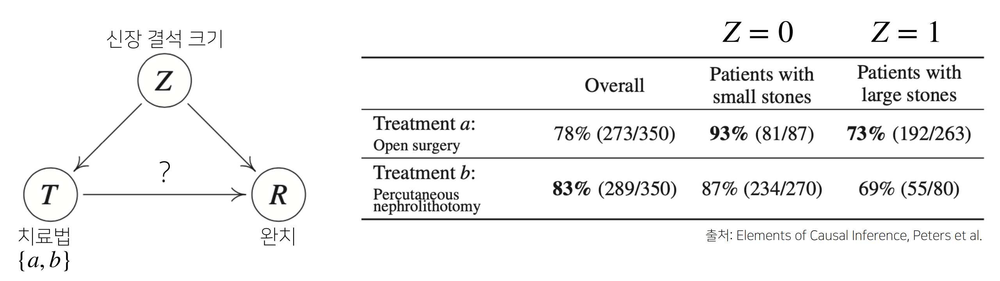

## 베이즈 통계학

이전에 배운 통계학 내용과 다소 다른 내용으로, 어떤 식으로 모델의 모수를 추정하고
모수를 추정할 때 사용되는 베이즈 정리에 대한 내용

머신러닝을 할 때 굉장히 많이 사용되는 철학이자 방법론

데이터가 추가될 때 마다 정보를 업데이트

- **조건부확률**

  - 베이즈 통게학을 이해하기 위해 이해해야할 개념
    

    - A와 B가 동시에 일어날 확률 = B가 일어날 확률 x B가 일어난 상황에서 A가 일어날 확률

  - 베이즈 정리는 조건부 확률을 이용하여 정보를 갱신하는 방법을 제시
    

    - A라는 새로운 정보가 주어졌을 때 P(B)로부터 P(B|A)를 계산하는 방법

  - 

    - D: 관찰하는 데이터

    - θ: 가설, 이벤트 또는 모델에서 계산하고 싶어하는 파라미터 혹은 모수

    - 사후확률: 주어진 데이터를 관찰했을 때 이 가설이 성립할 확률
      데이터를 관찰한 이후에 측정하는 확률

    - 사전확률: 데이터가 주어지지 않은 상황에서 θ에 대한 모델링 이전에 주어진 확률
      데이터를 분석하기 전에 가정한 확률, 베이즈 정리를 활용하여 업데이트

    - 가능도: 현재 주어진 파라미더에서 해당 데이터가 관찰될 확률

    - Evidence: 데이터 전체의 분포

      

- **예제**

  - 문제
    

    - 풀이

  - 시각화
    

    - True Positive: 양성 판정이 나왔을 때 실제 양성일 확률

    - True Negative: 음성이 나왔을 때 실제로 걸리지 않았을 경우

    - False Positive(1종 오류): 양성이 나왔는 데 걸리지 않은 경우

    - False Negative(2종 오류): 음성이 나왔는데 실제로 걸린 경우

    - 데이터 종류에 따라 1종 오류와 2종 오류의 무게가 다름
      → 질병의 경우 2종 오류가 발생하면 심각한 문제가 발생할 수 있음

    - P(θ|D)`정밀도`= TP/ TP + FP

      
      

- **베이즈 정리를 통한 정보의 갱신**

  - 베이즈 정리를 통해 새로운 데이터가 들어왔을 때 앞서 계산한 사후확률을
    사전확률로 사용하여 갱신된 사후확률을 계산
  - 
  - 
  - 베이즈 통계학의 장점은 데이터가 새로 들어올 때마다 사후확률을 업데이트 하는 것
    - 위 테스트를 3번 수행할 경우 99.1%의 신뢰도를 가짐

- **주의**

  - 조건부 확률은 유용한 통계적 해석을 제공하나 인과관계(causality)를 추론할 때 함부로 사용불가

    - 데이터가 많아져도 조건부 확률만 가지고 인과관계를 추론하는 것은 불가능
    - 실제로 많은 데이터 분석에서 조건부 확률로 인과관계를 추론하는 오류를 범함

  - 인과관계는 데이터 분포의 변화에 강건한 예측모형을 만들 때 필요

    - 인과관계만으로는 높은 예측 정확도를 담보하기 어려움

      

  - 인과관계를 알아내기 위해서는 중첩요인(confounding factor)의 효과를 제거하고
    원인에 해당하는 변수만의 인과관계를 계산해야 함
    

    - Z 의 효과를 제거하지 않으면 가짜 연관성(spurious correlation)이 나옴
    - 예시: "키가 클수록 지능이 높다." → 나이라는 요인을 고려하지 않은 결과, 가짜 연관성

  - 예제, 어느 치료법이 더 나은가?
    

    - 전체 완치율이 b가 더 낫지만, 신장 결석 크기에 따른 두 경우 모두 a가 나음
    - do(T=a)라는 조정(intervention)효과를 통해 Z의 개입을 제거

  - 심슨의 역설(Simpson's Paradox)

    - 데이터의 세부 그룹별로 추세나 경향성이 나타나지만 전체적으로 보면 추세가 사라지거나
      반대 방향의 경향성을 나타내는 현상
    - 인과관계에 대한 정확한 정리를 필요로 함
