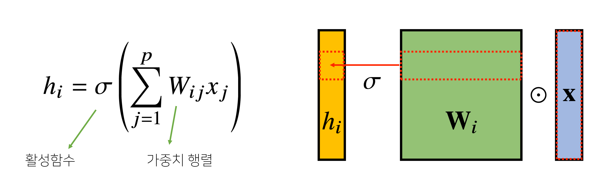

## CNN

앞에서 배운 MLP은 뉴런들이 선형모델과 활성함수로 모두 연결된 fully connected 구조

- 각 성분 hi에 대응하는 가중치 행 Wi이 필요
  - i가 변하게 되면 가중치 행렬의 행도 변화
    - 가중치 행렬의 구조가 커지게 됨
    - 학습시켜야되는 파라미터의 수가 커짐

- **Convolution 연산**
  

  - Convolution 연산은 커널을 입력벡터 상에서 움직여가며 선형모델과 합성함수가 적용되는 구조
    - 커널(V): 고정된 가중치 행렬
    - 입력벡터 x를 모두 활용하는 것이 아닌 커널사이즈 k에 대응되는 사이즈만큼 입력벡터 추출
    - i가 바뀌게 되면 σ(활성함수)와 V(커널)을 제외하고 Convolution 연산이 x입력 벡터 위에서 움직여가며 적용
    - 활성화 함수를 제외한 Convolution 연산도 선형변환의 한 종류
    - i의 개수나 값에 상관없이 공통된 사이즈인 커널을 사용해 파라미터 사이즈를 굉장히 줄일 수 있음
  - Convolution연산의 수학적인 의미는 신호를 커널을 이용해 국소적으로 증폭 또는 감소시켜 정보를 추출 또는 필터링 하는 것
    - continuous: 적분을 사용
      
    - discrete: 급수로 사용
      
    - 전체 정의역에서 *f*와 *g*를 곱해주고 z를 움직여가며 더해주거나 적분하는 방식
    - 엄밀히 따지면 CNN에서 사용하는 연산은 cross-correlation
  - 다차원에서도 계산이 가능
    
    - 데이터의 성격에 따라 사용하는 커널이 다름
    - 음성이나 텍스트는 1D, 흑백영상은 2D, 컬러영상은 3D..
    - 상황이 변하더라도 i, j, k의 위치가 변해도 커널의 값은 변하지 않음
      

- **2차원 Convolution 연산**

  - 2D-Conv 연산은 커널을 입력벡터 상에서 움직여가면서 선형모델과 합성함수가 적용되는 구조
    

    

    - 성분곱으로 더해줌

  - 입력 크기들 (H, W), 커널 크기를 (KH, KW), 출력 크기를 (OH, OW)라 하면 출력 크기는 아래와 같이 계산

    

    - 28x28 입력을 3x3 커널로 2D-Conv 연산하면 26x26이 됨

  - 채널이 여러개인 2차원 입력의 경우 2차원 Convolution을 채널 개수만큼 적용한다고 생각
    

    - 3차원부터는 행렬이 아닌 텐서(tensor)로 부름

    - 채널이 여러개인 경우 커널의 채널 수와 입력의 채널 수가 같아야 함

      

  - 텐서를 직육면체 블록으로 생각하는 방법
    

    - 커널을 OC개 사용하면 출력도 텐서

    

- **Convolution 연산의 역전파 이해하기**

  - 커널이 모든 입력데이터에 공통으로 적용되기 때문에 역전파 계산도 convolution 연산

    

    - Discrete일 때도 성립
      
    - 각 δ는  미분값
      
    - 입력 벡터에서는 곱해졌던 커널들을 통해서 그레디언트 전달
    - 역전파 단계에서 다시 커널을 통해 그레디언트 전달
    - 커널에는 δ에 입력값 x₃을 곱해서 전달
      
    - 각 커널에 들어오는 모든 그레디언트를 더하면 convolution 연산과 같음

    
