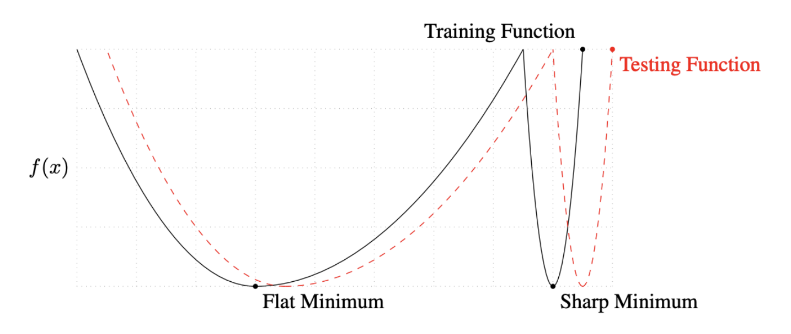
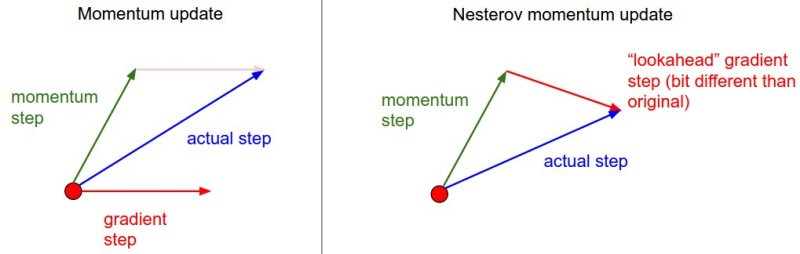

# 3. Optimization

**Gradient Descent**

local minimum?

- Generalization
  - iteration이 지나가면서 training error는 줄어듦
    - test error는 오히려 커지는 현상도 발생
    - 여기서 발생하는 것이 generalization gap
- Underfitting vs Overfitting
  - 추세를 반영하지 못하거나
  - 과하게 반영된 상태
- cross-validation
  - train data와 test data를 적당히 맞추는 것
  - k-fold
  - test data는 어떤 식으로던 학습에 활용해서는 안 됨
- Bias and Variance Tradeoff
  - cost minimize
    - bias와 variance를 모두 줄이는 방법은 사실상 어려움
    - noise
- Boostrapping
  - random sampling
  - 전체적인 모델들의 예측값의 일치도를 보고 불확실성을 예측하는 방식
- Bagging vs Boosting
  - **B**ootstrapping **agg**regati**ng**
    - 학습 데이터를 여러개로 나눠서 샘플링 하는 것
    - 앙상블이 주로 속하는 기법
    - parallel
  - Boosting
    - 잘 수행되지 않은 data에 대해서만 새로 모델을 만들어 합치는 기법
    - sequential

**Practical Gradient Descent Methods**

- Gradient Descent Methods
  - Stochastic gradient descent(sgd)
    - single sample로 부터 gradient를 업데이트
  - Mini-batch gradient descent
    - batch size만큼의 subset data로 업데이트
    - 일반적으로 사용하는 방식
  - Batch gradient descent
    - data를 전부 사용해 업데이트
- Batch-size matter
  - batch size는 생각보다 중요함
  - 큰 batch size를 사용하면 sharp minimizer에 도달
  - 작게 사용하면 flat minimizer에 도달
  - flat minimum일 때 data가 조금 엇나가도 유사한 값이 나옴
    - sharp일 경우 약간만 멀어져도 결과값이 크게 엇나감
      

자동적으로 기법을 사용해주지만, 이를 고르는 것이 문제

- (Stochastic) Gradient Descnt
  - learning rate를 적절히 잡는 것이 어려움
- Momentum
  - "관성"
  -  gradient의 방향성을 활용하고자 함
  - accumulation
- Nesterov Accelerated Gradient, NAG
  - lookahead gradient
  - 
  - momentum은 local minimum을 찾지 못할 수도 있음
- Adagrad
  - parameter가 적게 변화했으면 많이, 많이 변화했으면 적게 변화하도록 조정
  - Gt : gradient squares의 합
  - 뒤로 갈수록 학습이 멈춰지는 현상 발생
- Adadelta
  - Exponential Moving Average(EMA)를 가지고 Gt를 업데이트
  - learning rate가 없음
- RMSprop
- Adam
  - 가장 무난하게 활용하는 기법
  - EMA과 함께 momentum을 활용
  - adaptive moment estimation

**Regularization**

학습에 반대되도록 규제를 거는 것으로, test data에도 잘 동작하도록 만들기 위함

- Early Stopping
  - loss가 커지는 시점에서 종료하는 방식
- Parameter Norm Penalty
  - weight가 너무 커지지 않도록 만드는 방식
- Data Augmentation
  - 데이터는 많으면 많을수록 무조건 좋음
    - 문제는 데이터가 한정적이라는 점
    - 데이터를 변화시켜 늘리는 작업
    - label이 변환되지 않는 조건 하에서 수행
- Noise Robustness
  - input 또는 weight에 random noise를 집어넣는 작업
- Label Smoothing
  - data 두 개를 뽑아서 섞어주는 작업
  - label을 섞어버림
  - ResNet, Mixup, Cutout, CutMix
- Dropout
  - neural network의 weight를 일반적으로 0으로 바꾸는 것
  -  roburst한 feature를 잡을수 있다고 해석함
- Batch Normalization
  - 논란이 많은 논문
    - "Internal Covariate Shift"
  - BN을 적용하고자 하는 Layer에 statistics를 정규화 시키는 것
  - 일반적으로 성능 향상이 일어나긴 함
  - Batch Norm, Layer Norm, Instance Norm, Group Norm

**실습**

- 오랜 시간, 많은 데이터가 있으면 optimizer의 중간 결과 정확도와 다른 결론이 나올 수 있음

