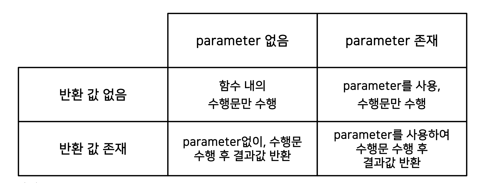

## Function and Console I/O

#### Function

- **개요**

  ```python
  def function_name(parameters):
      #수행문 1
      #수행문 2
      return # 반환값
  ```

  - 어떤 일을 수행하는 코드의 덩어리
  - 반복적인 수행을 1회만 작성 후 호출
  - 코드를 논리적인 단위로 분리
  - 캡슐화: 인터페이스만 알면 타인의 코드 사용
  - 수학의 함수와 유사하며 모두 입력 값과 출력 값으로 구성

- **형태**

  - parameter 유무, return value 유무에 따라 형태가 다름
    


<hr>

#### Console In/Out


어떻게 프로그램과 데이터를 주고 받을 것인가?

- **콘솔창 입출력**
  
  - input
  
    - input() 함수는 콘솔창에서 문자열을 입력 받는 함수
  
  - print
  
    - 출력하는 함수
    - 프린트문은 기본적인 출력 외에 출력 양식의 형식을 지정 가능
    - `%string`, `format`, `fstring`
  
  - formatting
  
    - padding: 여유 공간을 지정하여 글자 배열 + 소수점 자릿수 맞추기
    - naming: 해당 표시할 내용을 변수로 표시하여 입력
  
  - f-string
  
    - ```python
      name = James
      age = 17
      print(f"Hi, I'm {name}, {age} years old.")
      ```
