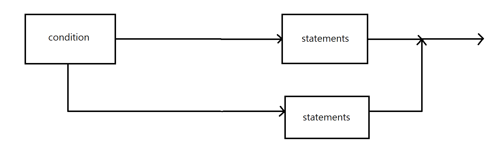
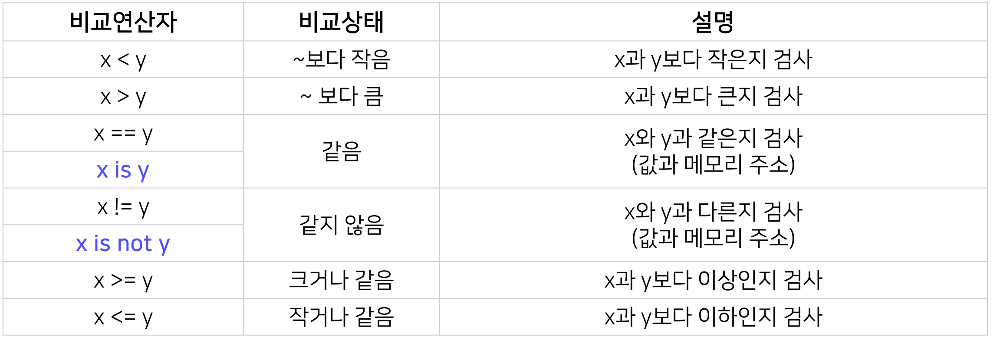

## Conditionals and Loops

#### Condition

- **조건문이란?**

  - 조건에 따라 특정한 동작을 하게 하는 명령어

  - 파이썬에서는 `if`, `else`, `elif` 등의 예약어 사용
    

  - if 다음에 조건을 표기하여 참/거짓 판별

  - 비교 연산자 활용
    

  - 존재하는 것은 참, 없으면 거짓으로 판별

    ```python
    #참
    1, ['a'], 'string'...
    
    #거짓
    0, []...
    ```

  - -5 부터 256까지의 수는 같은 주소값을 가짐

    ```python
    # is는 메모리 주소를 비교하는 연산자
    
    a = 5
    b = 5
    a is b		# True
    a = 300
    b = 300
    a is b		# False
    
    # a 와 b의 '값'이 같다면 a == b는 항상 True
    ```

  - `all` 하나라도 `False`이면 `False`

  - `any`하나라도 `True`이면 `True`


- **삼항연산자**
  - 조건문을 사용하여 참일 경우와 거짓일 경우를 한 줄에 표현(비권장)


<hr>

#### Loops

- `for`, `while` 등 반복수행을 위한 명령문

- 시작 조건, 종료 조건, 수행 명령으로 구성

- **for loop**

  - 반복 범위를 지정하여 반복문 수행

    ```python
    loop_list = [1, 2, 3, 4, 5]
    for looper in loop_list:
        print(looper, end = ' ')
        
        #1 2 3 4 5
        #loop_list에는 리스트, 문자열 등 순서가 있는 자료형이 들어올 수 있다.
    
    for i in range(100):
        print(i, end = ' ')
        
        #0 1 2 3 4 5 6 7 ... 99
        # range(start, end, step)는 시작이 start, 끝이 end-step까지이다.
        # range(n) 처럼 쓰면 start = 0, step = 1
    ```

  > **변수명**
  >
  > - 임시적인 변수는 대부분 i, j, k로 지정(수학에서 x, y, z 사용 관례와 유사)
  >
  > **0부터 시작**
  >
  > - 대부분 0부터 반복을 시작
  >
  > **무한 loop**
  >
  > - 반복 명령이 끝나지 않는 프로그램 오류
  > - CPU, 메모리 과다 점유 발생

- **While**

  - 조건을 만족하는 동안 반복 명령문을 수행
  - 실행 횟수를 알 수 있는 `for`문은 `while`문으로 변환 가능
  - `break` 로 반복문을 종료하거나  `continue`로 남은 명령을 건너뜀

- **else**

  - 반복 조건을 만족하지 않을 때 1회 수행되는 명령
  - `break`로 종료될 경우 수행되지 않음

- **가변 중첩 반복문**(variable nested loops)

  - 실제 프로그램에서는 반복문은 사용자의 입력에 따라 가번적으로 반복되며 중복되어 반복


<hr>

#### Debugging

- **개요**
  - 코드의 오류를 발견하여 수정하는 과정
  - 오류의 '원인'을 알고 '해결책'을 찾아야 함
  - 문법적 에러를 찾기 위한 에러 메세지 분석
  - 논리적 에러를 찾기 위한 테스트
- **오류**
  - 흔한 실수
    - 들여쓰기, 오탈자, 대소문자 구분
  - 논리적 에러
    - 뜻대로 실행되지 않는 코드


- **검색**
  - Google
  - stack overflow

