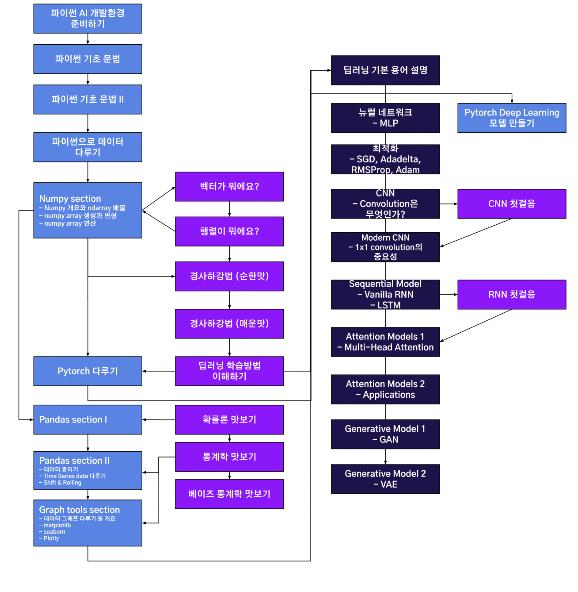

## Level 1

- **Python**
  - [Basic computer class](./Python_1-1_Basic_computer_class)
  - [파이썬 개요](./Python_1-2_Python_Overview)
  - [파이썬 코딩 환경](./Python_1-3_Coding_environment)
  - [Variables & List](./Python_2-1_Variables)
  - [Function and Console I/O](./Python_2-2_Function_and_Console_InOut)
  - [Conditionals and Loops](./Python_2-3_Conditionals_and_Loops)
  - [Numerical Python - numpy](./Python_6_Numerical_Python-numpy)

- **AI Math**
  - [벡터가 뭐에요?](./AI_Math_1_What_is_vector)
  - [행렬이 뭐에요?](./AI_Math_1_What_is_matrix)
  - [경사하강법 - 순한맛](AI_Math_3_Gradient_descent_1)
  - [경사하강법 - 매운맛](AI_Math_3_Gradient_descent_2)
  - [딥러닝 학습방법 이해하기](AI_Math_5_How_to_deep_learning)
  - [확률론 맛보기](AI_Math_6_Probability_theory_basic)
  - [통계학 맛보기](AI_Math_7_Statistics_basic)
  - [베이즈 통계학 맛보기](AI_Math_8_Bayesian_statistics)
  - [CNN](AI_Math_9_CNN)
  - [RNN](AI_Math_10_RNN)

- **PyTorch**
  - [Introduction to PyTorch](./PyTorch_1_Introduction_to_PyTorch/)
  - [PyTorch Basic](./PyTorch_2_PyTorch_Basic/)
  - 
